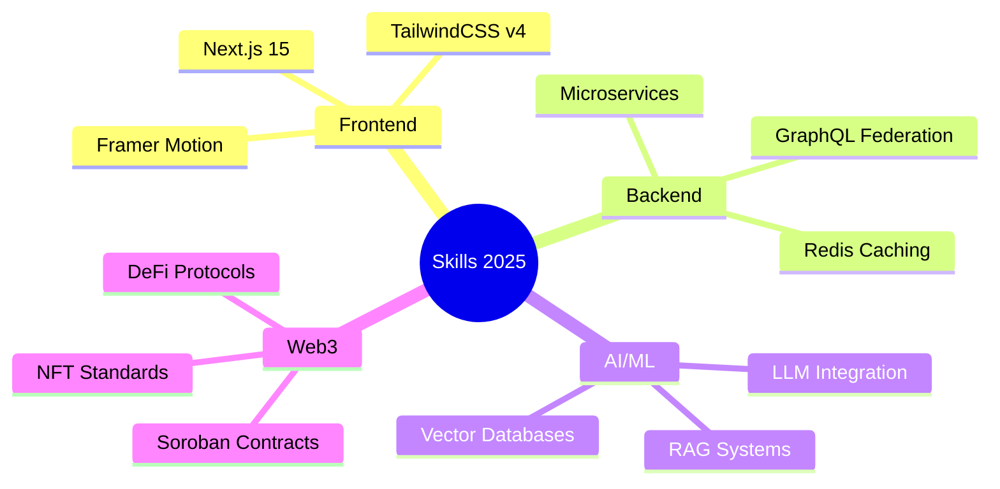

<div align="center">


<br/><br/>

<a href="https://git.io/typing-svg"></a>

<br/>

<p align="center">
  <a href="https://web.facebook.com/minh.le.187327/"></a>
  <a href="https://x.com/minh_quang28278"></a>
  <a href="https://www.linkedin.com/in/quang-minh-lê-08b71037a/"></a>
  <a href="mailto:157082841+minhleeee123@users.noreply.github.com"></a>
</p>


</div>

---

## 🚀 About Me

<div align="center">
  
  
  
  
</div>

<div align="center">
  <sub><b>Open to:</b> freelance work • open-source collaboration • hackathons</sub>
</div>

<br/>

```typescript
const developer = {
    name: "Lê Quang Minh",
    location: "Hà Nội, Vietnam 🇻🇳",
    role: "Full-Stack Developer & Freelancer",
    
    currentlyWorkingOn: [
        "Building web applications with React & Node.js",
        "Exploring AI integration in real-world projects",
        "Smart contract development with Stellar/Soroban",
        "Freelance full-stack development projects"
    ],
    
    lookingFor: [
        "Freelance opportunities",
        "Open-source collaborations",
        "AI/ML integration projects",
        "Blockchain & Web3 innovations"
    ],
    
    achievements: {
        hackathons: {
            "Agent Arena University Hackathon": "🥉 3rd Place - CryptoInsight AI",
            "Scoop AI Hackathon": "🏅 4th Place - AI Email Manager"
        },
        contributions: "11,000+ GitHub contributions",
        projects: "15+ Full-stack applications"
    },
    
    funFact: "I can spend hours debugging a semicolon — only to realize it was a missing one 😅"
};
```

---

## 💻 Tech Stack

<details open>
<summary><b>🎨 Frontend Development</b></summary>
<br/>
<p align="center">
  
  
  
  
  
  
  
  
  
</p>
</details>

<details open>
<summary><b>⚙️ Backend Development</b></summary>
<br/>
<p align="center">
  
  
  
  
  
  
  
</p>
</details>

<details open>
<summary><b>📱 Mobile & Cross-Platform</b></summary>
<br/>
<p align="center">
  
  
  
</p>
</details>

<details open>
<summary><b>🗄️ Databases</b></summary>
<br/>
<p align="center">
  
  
  
  
</p>
</details>

<details open>
<summary><b>🤖 AI & Machine Learning</b></summary>
<br/>
<p align="center">
  
  
  
</p>
</details>

<details open>
<summary><b>⛓️ Blockchain & Web3</b></summary>
<br/>
<p align="center">
  
  
</p>
</details>

<details open>
<summary><b>🛠️ Tools & Platforms</b></summary>
<br/>
<p align="center">
  
  
  
  
  
  
  
</p>
</details>

---

## 📊 GitHub Analytics

<div align="center">
  
  
</div>

<br/>

<div align="center">
  
  
</div>

---

## 🎯 Hackathon Achievements

<div align="center">

| 🏆 Achievement | 🚀 Project | 🎨 Tech Stack | 📅 Year |
|:---:|:---:|:---:|:---:|
| 🥉 **3rd Place** | **CryptoInsight AI** | IQ ADK, Gemini, React, Node.js | 2024 |
| 🏅 **4th Place** | **AI Email Manager** | Spoon OS, Python, FastAPI, React | 2025 |

</div>

<div align="center">
  <a href="https://github.com/minhleeee123/for_hackathon_t12">
    
  </a>
  <a href="https://github.com/minhleeee123/hackathon_final">
    
  </a>
</div>

---

## 🌟 Featured Projects

<div align="center">

<table>
<tr>
<td width="50%">

### 🔐 [Stellar Digital Identity](https://github.com/minhleeee123/stellar-digital-identity)
Blockchain-based identity verification using Soroban smart contracts
<br/><br/>


</td>
<td width="50%">

### 🎭 [Emotion Detection System](https://github.com/minhleeee123/thiGiacMayTinh)
Real-time emotion recognition using YOLOv8/v11 and DeepFace
<br/><br/>


</td>
</tr>

<tr>
<td width="50%">

### 🏠 [Dormitory Management System](https://github.com/minhleeee123/QLKTX)
Full-stack system with JWT auth and role-based access control
<br/><br/>


</td>
<td width="50%">

### 🌐 [HoloCore 3D](https://github.com/minhleeee123/honogram_3D)
Interactive 3D hologram visualization with AI voice control
<br/><br/>


</td>
</tr>

<tr>
<td width="50%">

### 📱 [Flutter Recipe Book](https://github.com/minhleeee123/2025_LTTBDD_N04)
Bilingual recipe management mobile app with animations
<br/><br/>


</td>
<td width="50%">

### 🛒 [EverShop E-Commerce](https://github.com/minhleeee123/my-app)
Modern e-commerce platform with GraphQL API
<br/><br/>


</td>
</tr>
</table>

</div>

---

## ✍️ Random Dev Quote

<div align="center">
  
  
  
</div>

---

## 📈 Contribution Graph

<div align="center">
  
  
  
</div>

---

## 💡 Currently Learning & Exploring

<div align="center">



</div>

---


